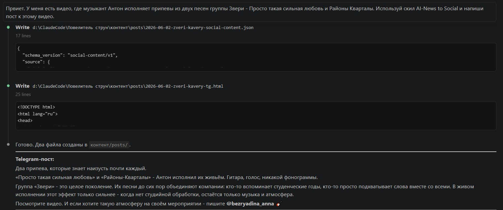
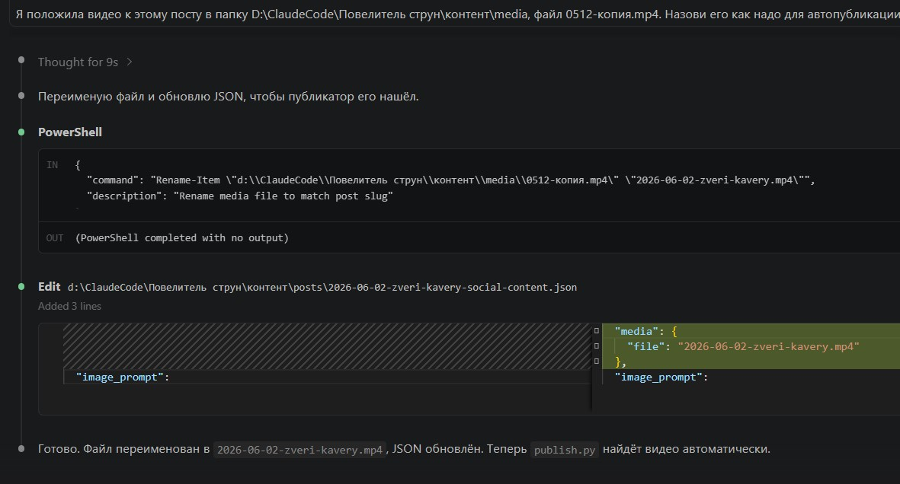
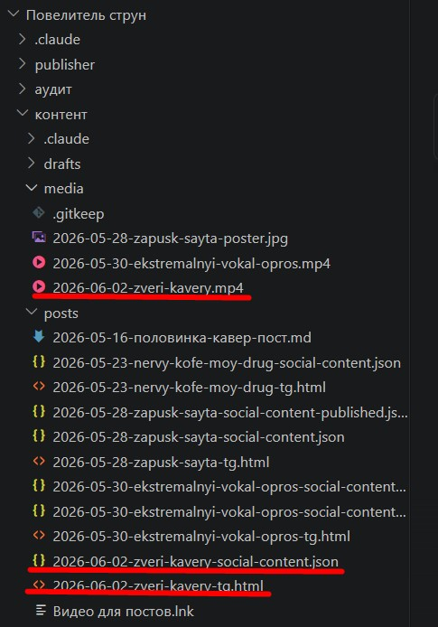
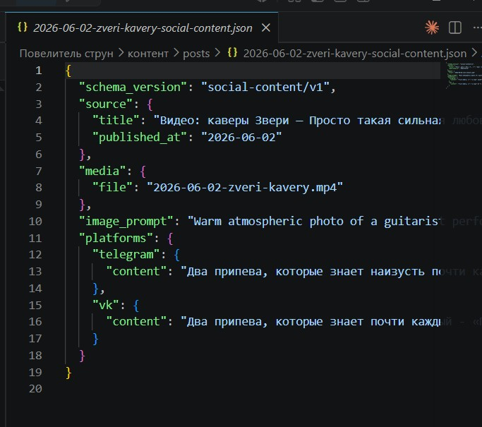
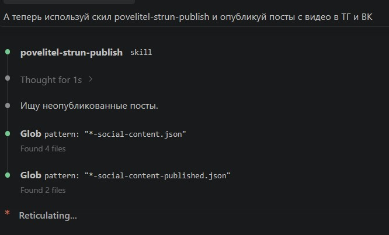
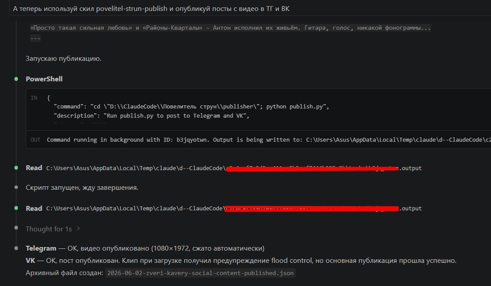
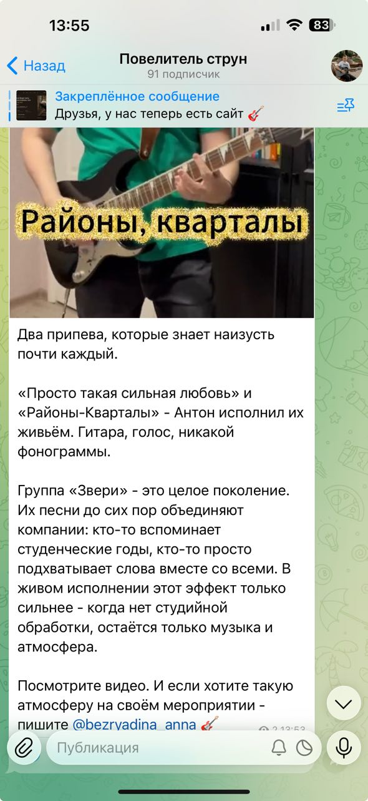
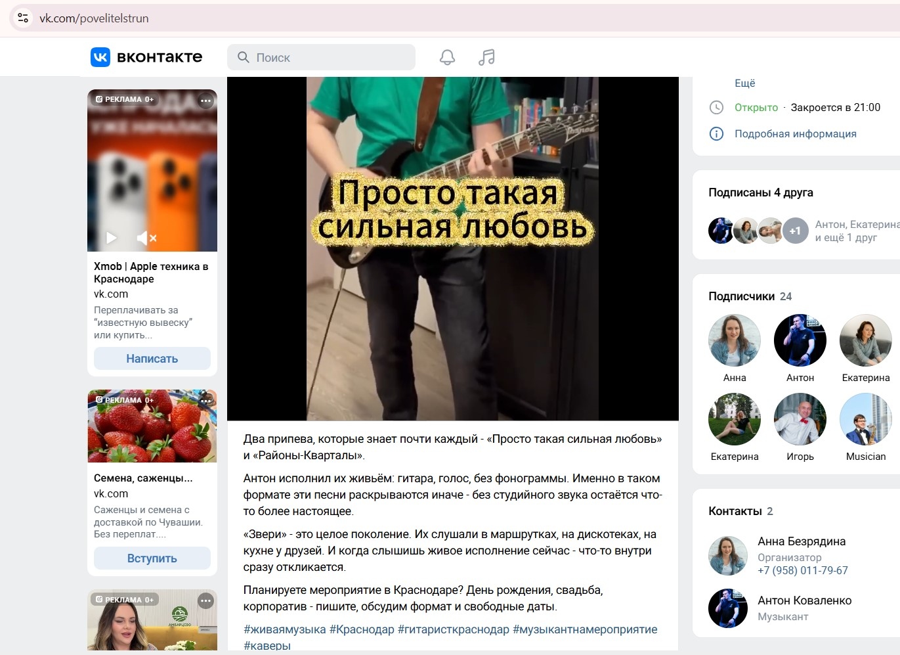
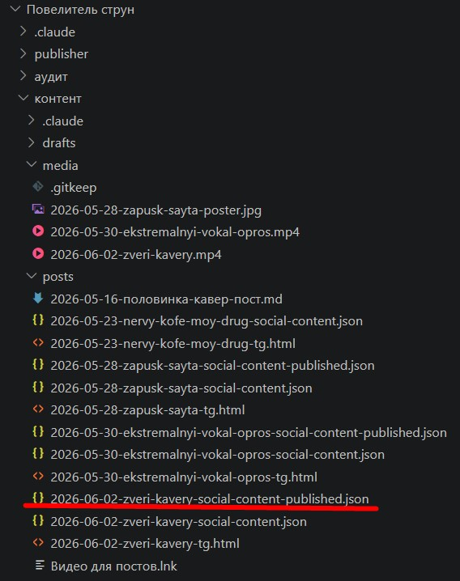

# Контент-завод

Автогенерация и автопубликация постов для соцсетей на основе Claude AI.
Сделан для музыкального проекта «Повелитель струн».

## Как это работает

```
[Ты пишешь тему]  →  [Claude генерирует пост]  →  [Ты проверяешь]  →  [Публикация в TG, VK, MAX, Rutube]
```

**Шаг 1 — Написать черновик**

Открыть Claude Code в папке `контент/` и попросить агента:

> «Напиши пост для Telegram и ВКонтакте. Тема: ...»

Агент сохранит файл в `контент/posts/` в формате:
```
YYYY-MM-DD-название-social-content.json
```

**Шаг 2 — Проверить пост**

Открыть файл, прочитать текст в блоках `platforms → telegram → content` и `platforms → vk → content`.  
Если нужно исправить — отредактировать прямо в файле.

**Шаг 3 — Опубликовать**

```bash
cd publisher
python publish.py
```

Скрипт найдёт все файлы с сегодняшней датой и разошлёт их по подключённым площадкам.  
После публикации автоматически создаётся архивный файл `...-published.json`: он же защищает
от повторной отправки одного и того же поста.

---

## Демонстрация

**1. Запрос агенту — пишем тему поста**  


**2. Переименование видео для автопубликации**  


**3. Готовый пост и видео в папке**  


**4. Текст поста в JSON-файле**  


**5. Запуск скрипта публикации**  


**6. Результат — Telegram и VK: OK**  


**7. Опубликованный пост в Telegram**  


**8. Опубликованный пост ВКонтакте**  


**9. Архивный файл — подтверждение публикации**  


---

## Структура проекта

```
контент/
  posts/        — посты в формате JSON
  media/        — фото и видео для постов

publisher/
  publish.py    — скрипт публикации
  platforms/
    telegram.py — публикация в Telegram (Bot API)
    vk.py       — публикация ВКонтакте (VK API)
  max_*.js      — публикация в MAX через Playwright
  rutube_*.js   — загрузка видео на Rutube через Playwright
  *-evidence/   — снимки экрана и логи каждой публикации
  .env          — токены (не передавать никому)
```

---

## Настройка

Скопировать `.env.example` → `.env` и заполнить:

```
TELEGRAM_BOT_TOKEN=токен_бота
TELEGRAM_CHANNEL_ID=id_канала
VK_TOKEN=токен_vk
VK_GROUP_ID=id_группы
```

---

## Установка зависимостей

```bash
pip install requests python-dotenv vk-api imageio-ffmpeg
```

---

## Площадки

| Площадка | Как подключена |
|----------|----------------|
| Telegram | Bot API |
| ВКонтакте | VK API: посты и истории |
| MAX | Playwright, управление браузером |
| Rutube | Playwright, загрузка видео |

У MAX и Rutube нет открытого API, поэтому публикация в них сделана через управление
браузером: скрипт открывает площадку в сохранённом профиле и выкладывает пост сам.
Каждый шаг фиксируется снимком экрана и логом в папках `*-evidence/`.
